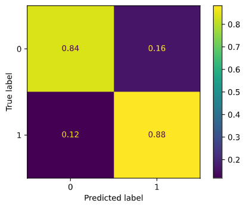
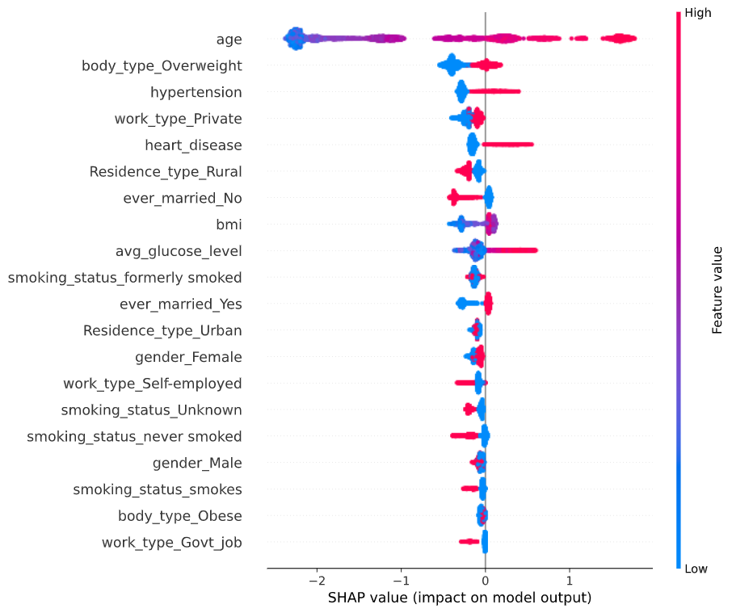

# Stroke Prediction Web App

Using this [Kaggle Stroke Prediction Dataset](https://www.kaggle.com/fedesoriano/stroke-prediction-dataset), I trained and deployed an XGBoost Classifier to predict whether or not a user is likely to suffer from a stroke. In this repository you will find data analysis of the kaggle dataset in [notebooks](notebooks), model training and data processing in [training](training), and the web app front end and backend in [app](app). 

## Motivation
According to the World Health Organization, around 15 million people suffer from strokes worldwide each year. Of those 15 million, 5 million die, and another 5 million are permanently disabled [source](http://www.strokecenter.org/patients/about-stroke/stroke-statistics/).
The  CDC (Centre for Disease Control and Prevention) states that up to 80% of all strokes could be prevented by healthy life style changes, such as eating fresh fruits and vegetables, and getting plenty of exercise.

What if we could look into the future and tell someone with a reasonable degree of accuracy that they would have a stroke if they didn't change their unhealthy living habits?

That question was my inspiration to building a Stroke Predictor using the Stroke Prediction Dataset from Kaggle.

## Getting Started

To run this project locally follow these steps:

* 1. Pull the docker image to your local machine using this command ```docker pull seanashley/strokepredictor:2.4```
* 2. Run the docker container on your local machine using this command ```docker run -d -p 5000:5000 seanashley/strokepredictor:2.4```
* 3. Enter 0.0.0.0:5000 into your browser, and enter your information on the home page.
* 4. See the predictors results!

Alternative:
Visit the hosted website [here](https://stroke-predictor.azurewebsites.net)


## Deployment

The web app was deployed using Docker and Azure.

## Built With

* [Flask](https://flask.palletsprojects.com/en/1.1.x/) - The web framework used
* [Sci-kit Learn](https://scikit-learn.org/stable/) - Tool used to help pre-process data
* [XGBoost](https://xgboost.readthedocs.io/en/latest/) - Model used
* [Pandas](https://pandas.pydata.org/sq) - Library used for data manipulation
* [SQLAlchemy](https://www.sqlalchemy.org/) - Library used to create SQLite database
* [Waitress](https://docs.pylonsproject.org/projects/waitress/en/stable/) - Library used to serve website
* [Azure](https://azure.microsoft.com/en-ca/) - Cloud computing service used to host website
* [Docker](https://www.docker.com/) - Used to containerize web app
* [Plotly](https://plotly.com/) - Used to plot data on the webpage in an interactive manner
* [imblearn](https://imbalanced-learn.org/stable/) - library to handle unbalanced dataset
* [numpy](https://numpy.org/) - library used for data manipulation
* [Seaborn](https://seaborn.pydata.org/) - Library used for data visualizations

## Project Conclusions

By tuning my threshold, I was able to improve the accuracies drastically. When the threshold was set to 0.3, the model produced a true positive accuracy of 88% and a true negative accuracy of 84%, which are both great results!
<div style="text-align:center"></div>

<div style="text-align:center"></div>
From this graph we can see that age far and away is the most important feature. The older you are, the more at risk the model thinks you are for stroke. Other features that seem to have a massive positive impact (that is increase the chance of the model predicting that you will have a stroke) include hypertension, high BMI, heart disease, and high average blood glucose level. This all in line with the best current research on the largest risk factors of strokes.
The future of the medical industry is bright, and advances in AI show extreme promise in revolutionizing the way we diagnose and treat patients. Think about the lives that could be saved if we could, beyond a shadow of a doubt tell patients that they would suffer a stroke if they didn't stop their unhealthy habits. 
That's a future I want, one where preventable deaths are prevented.

## Files
```
├── app 
│   ├── dataprocessing.py : File containing numerous data processing functions to transform our raw data frame into usable data
│   ├── predict.py : File containing functions that takes in user inputs from home.html and processes it, and uses it to make a prediction.
│   ├── requirements.txt : File containing all required python librairies
│   ├── run.py: Main web app file containing all end points, and serves website.
│   ├── templates
│   │   ├── dataoverview.html : HTML file containing graphs detailing training data
│   │   ├── home.html : HTML file containing the form the user must fill out to get their prediction
│   │   ├── negative.html : HTML file to be shown when the user gets a negative results (eg no stroke) from the model
│   │   └── positive.html : HTML file to be shown when the user gets a negative results (eg no stroke) from the model
│   └── train.py : File containing model pipeline , hyperparameter tuning, and training code
├── data
│   ├── cleaned_data.csv : Dataframe passed thru all of the pre processing steps, used to create shap graph
│   ├── graphdata.db : SQLite database containing data of graphs on dataoverview.html
│   ├── healthcare-dataset-stroke-data.csv : Original dataset from kaggle
│   └── model5.pickle : Pickled Sklearn pipeline contained trained model.
├── dockerfile :  File to build docker image
├── LICENSE : Apache License
├── notebooks
│   ├── data_exploration.ipynb : Jupyter Notebook exploring the raw data from kaggle, contains initial discoveries
│   ├── graphdata.db : same as in data
│   ├── graphs : various saved graphs from jupyter notebook
│   │   ├── ever_married.png
│   │   ├── final_confusion_matrix.png
│   │   ├── gender.png
│   │   ├── heart_disease.png
│   │   ├── hypertension.png
│   │   ├── initial_confusion_matrix.png
│   │   ├── shap_values.png
│   │   ├── smoking_status.png
│   │   ├── smoteen_stroke_pie.png
│   │   ├── stroke_before_smoteen.png
│   │   └── stroke.png
│   ├── stroke_correlation.ipynb : Jupyter notebook exploring the how common strokes are in different demographics
│   └── tsne.png : tsne graph
├── README.md : This file 
├── requirements.txt : File containing all required python librairies
└── training
    ├── dataprocessing.py :File containing numerous data processing functions to transform our raw data frame into usable data
    ├── post_training_analysis.ipynb: Analysis and graph generation for feature weights and shap values
    ├── smoteen_vis.ipynb : Notebook showing the impact of smoteen
    └── train.py : File containing model pipeline , hyperparameter tuning, and training code
```

## Authors

* **Sean Ashley** - *Backend, Deployment, ML, and Data Science Work* - [sean-ashley](https://github.com/sean-ashley)
* **Hannah Hepburn** - *Frontend* - [HMHepburn](https://github.com/HMHepburn)

## License

This project is licensed under the Apache License - see the [LICENSE](LICENSE) file for details

## Acknowledgments
* [Kaggle Stroke Data Set](https://www.kaggle.com/fedesoriano/stroke-prediction-dataset?rvi=1)
* [Udacity](https://www.udacity.com/)

This was done as my capstone project for the Udacity Data Science Nanodegree 
